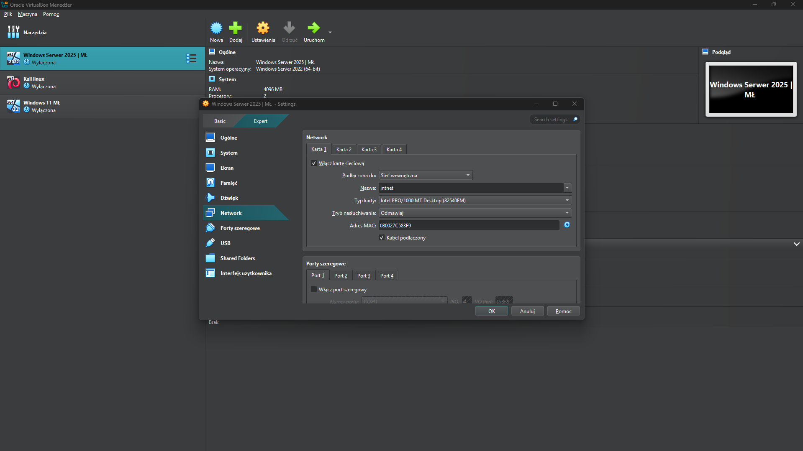
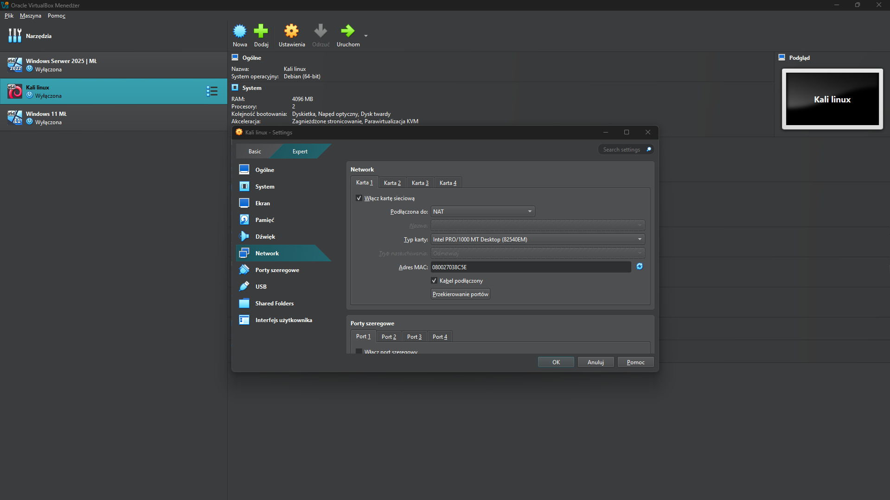
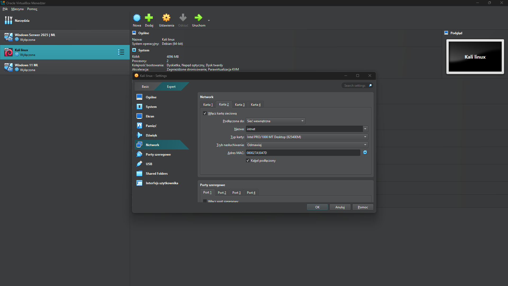
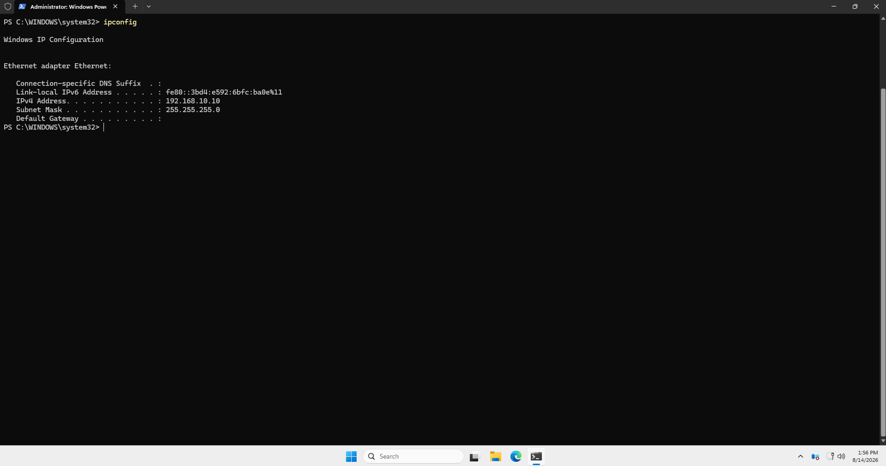
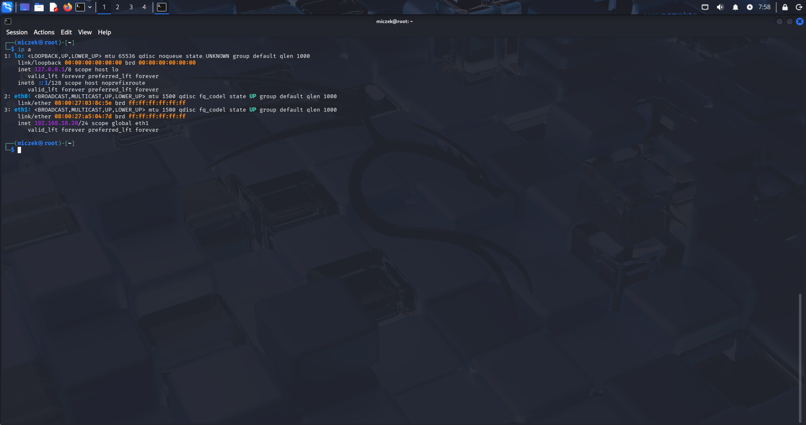
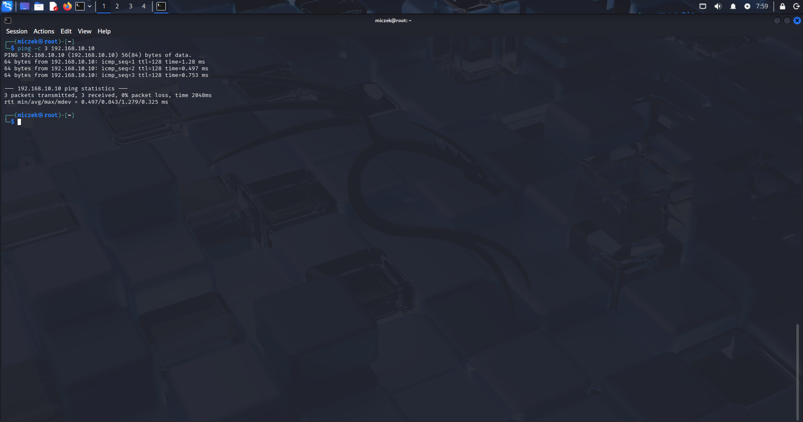

# 01 - Network Setup

This document covers the VirtualBox network configuration used to build an isolated lab environment for the Domain Controller (DC01) and the attacker machine (Kali Linux).

## 1. Network Architecture

The lab uses VirtualBox's **Internal Network** mode, named `intnet`. Internal Network traffic is visible only between VMs attached to the same network name — there is no route to the host machine, the home network, or the internet. This guarantees the lab stays fully isolated, which matters for two reasons:

- Attacks performed later in this project (Kerberoasting, LLMNR/NBT-NS Poisoning) never touch anything outside the lab
- The environment is fully reproducible and safe to experiment in without any risk to other devices on the network

| Machine | Role | Adapter | Network mode | IP Address |
|---|---|---|---|---|
| DC01 (Windows Server 2025) | Domain Controller | Adapter 1 | Internal Network (`intnet`) | 192.168.10.10 |
| Kali Linux | Attacker | Adapter 1 | NAT | (dynamic, internet access) |
| Kali Linux | Attacker | Adapter 2 | Internal Network (`intnet`) | 192.168.10.20 |

## 2. Domain Controller — Network Adapter

DC01 uses a single adapter attached to the Internal Network `intnet`.



## 3. Kali Linux — Dual Adapter Setup

Kali Linux uses **two** network adapters:

- **Adapter 1 — NAT**: provides outbound internet access, used only for installing and updating tools (e.g. `apt update`, `pip install --upgrade impacket`). This adapter has no route to the lab network and plays no part in the attacks themselves.
- **Adapter 2 — Internal Network (`intnet`)**: the actual lab network, used to communicate with DC01 and carry out attacks.





**Why two adapters instead of one:** Internal Network has no internet access by design — that's the entire point of using it. Rather than repeatedly switching a single adapter between NAT and Internal Network (and risking forgetting to switch back before an attack), a second, dedicated adapter keeps both connections available at once without compromising the isolation of the lab network.

## 4. Verifying IP Configuration

### Domain Controller

```powershell
ipconfig
```

Confirms DC01 holds `192.168.10.10` on its Ethernet adapter.



### Kali Linux

```bash
ip a
```

Confirms Kali holds `192.168.10.20/24` on `eth1` (the Internal Network adapter), separate from `eth0` (NAT).



**Note:** the static IP on `eth1` occasionally resets after the interface is reconnected or the NetworkManager service restarts. If `ip a` shows no IPv4 address on `eth1`, it can be reassigned manually:

```bash
sudo ip addr add 192.168.10.20/24 dev eth1
```

## 5. Connectivity Test

With both machines configured, connectivity between Kali and DC01 was confirmed with a simple ping test:

```bash
ping -c 3 192.168.10.10
```

Result: 3/3 packets received, 0% packet loss — confirming the Internal Network link between both machines is functional.



## Status

✅ Isolated Internal Network (`intnet`) configured and verified between DC01 and Kali Linux.

**Next step:** Install Active Directory Domain Services and promote DC01 to the first Domain Controller in a new forest (see `02-domain-controller-setup.md`).