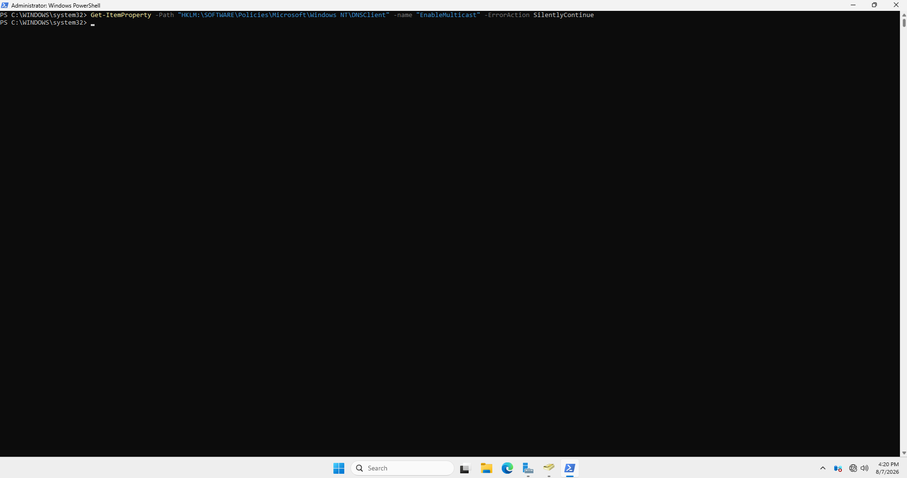

\# 03 - AD Users, OUs \& Service Account (Kerberoasting Setup)


This document covers building out the Active Directory structure with organizational units, fictional user accounts, and a deliberately vulnerable service account intended as the target for a later Kerberoasting attack.


\## 1. Organizational Unit Structure


To simulate a realistic corporate environment, the default flat AD structure was replaced with four Organizational Units:


| OU | Purpose |

|---|---|

| IT | IT department accounts |

| HR | Human Resources accounts |

| Finance | Finance department accounts |

| ServiceAccounts | Service accounts used by applications/services |


!\[AD OU structure](../images/ad-ou-structure.png)


\## 2. Fictional User Accounts


Several fictional users were created across the IT, HR, and Finance OUs to populate the directory with realistic-looking accounts.


!\[Users in IT OU](../images/ad-users-it.png)


\*(Passwords used are lab-only test credentials and are not documented here.)\*


\## 3. Vulnerable Service Account (Kerberoasting Target)


A service account, `svc-sql`, was created in the `ServiceAccounts` OU to represent a typical SQL Server service account — a common real-world target for Kerberoasting due to weak, rarely-rotated passwords.


\*\*Configuration:\*\*

\- Account: `svc-sql`

\- "Password never expires" enabled (realistic but risky configuration commonly found in production environments)


\### Setting the SPN (Service Principal Name)


An SPN was registered for the account to associate it with a simulated SQL Server service:


```powershell

setspn -A MSSQLSvc/dc01.corp.local:1433 corp\\svc-sql

```


!\[SPN registered for svc-sql](../images/spn-svc-sql-registered.png)


\*\*Why this matters:\*\* once a service account has a registered SPN, any authenticated domain user can request a Kerberos service ticket for it. That ticket is encrypted with the service account's password hash, and can be extracted and cracked offline — without touching the Domain Controller again. This is the foundation of the Kerberoasting attack technique.


\### Verifying the SPN from an Attacker's Perspective


To simulate domain enumeration, the following command lists all registered SPNs in the domain:


```powershell

setspn -T corp.local -Q \*/\*

```


This confirms `svc-sql` is discoverable as a Kerberoastable target:


!\[SPN verification](../images/spn-verification.png)


## 4. LLMNR Poisoning — Enabling the Second Attack Vector

Unlike Kerberoasting, LLMNR (Link-Local Multicast Name Resolution) poisoning does not require any explicit misconfiguration — LLMNR is **enabled by default** on Windows and is only disabled through explicit Group Policy.

To confirm this default (vulnerable) state, the following command was run on the Domain Controller:

```powershell
Get-ItemProperty -Path "HKLM:\SOFTWARE\Policies\Microsoft\Windows NT\DNSClient" -Name "EnableMulticast" -ErrorAction SilentlyContinue
```

No value was returned, confirming that no policy explicitly disables LLMNR — meaning it remains active on its default (enabled) setting.



**Why this matters:** with LLMNR enabled, any machine on the network can be tricked into resolving a non-existent hostname via multicast, allowing an attacker (e.g. using Responder on Kali) to spoof the response and capture NTLM authentication hashes.
\## Status

✅ AD structure, fictional users, and Kerberoasting-vulnerable service account successfully configured.


\*\*Next step:\*\* Perform the Kerberoasting attack from the Kali Linux VM (see `04-kerberoasting-attack.md`).

